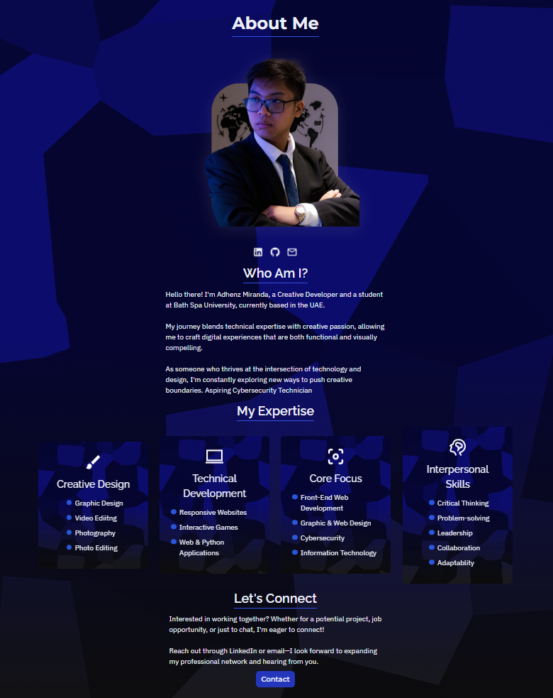
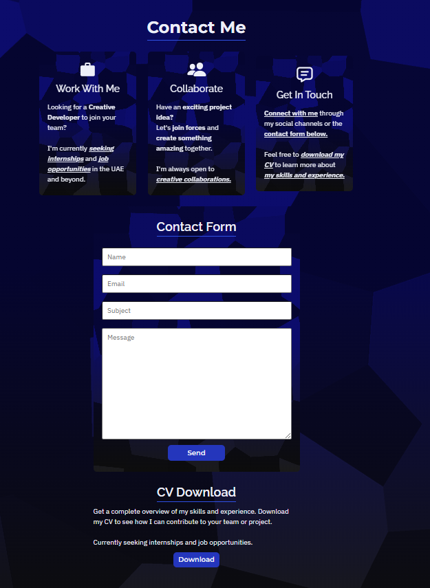

# 🎨 AM Portfolio Website

A modern, responsive portfolio website built with Django and SCSS, showcasing the projects, skills, and professional journey of yours truly, Adhenz Miranda.


---

## ✨ Features

- Responsive, mobile-first design
- Modern UI with custom SCSS and smooth GSAP animations
- Django backend with REST API support
- Project showcase with featured projects carousel
- Detailed project pages with galleries and embeds
- Contact form with backend integration
- Downloadable CV
- Accessible and SEO-friendly

---

## 🛠️ Tech Stack

**Frontend:**

- HTML5, SCSS/CSS3
- JavaScript (with GSAP for animations)

**Backend:**

- Django 5.x
- Django REST Framework
- SQLite (development) / PostgreSQL (production-ready)

**Other Tools:**

- Cloudinary (image hosting)
- Node.js & npm (for SCSS compilation)
- Git & GitHub
- Visual Studio Code

---

## 📦 Project Structure

```
am-portfolio-website/
├── static/           # Static assets (images, CSS, JS, SCSS)
├── templates/        # Django HTML templates
├── projects/         # Django app: models, views, admin, serializers
├── manage.py         # Django management script
└── README.md         # Project documentation
```

---

## 🚀 Getting Started

### Prerequisites

- Python 3.10+
- Node.js & npm

### Installation

1. **Clone the repository:**

   ```sh
   git clone https://github.com/adhenzmiranda/am-portfolio-website.git
   cd am-portfolio-website
   ```

2. **Create and activate a virtual environment:**

   ```sh
   python -m venv venv
   # On Windows:
   venv\Scripts\activate
   # On macOS/Linux:
   source venv/bin/activate
   ```

3. **Install Python dependencies:**

   ```sh
   pip install -r requirements.txt
   ```

4. **Install Node.js dependencies (for SCSS):**

   ```sh
   npm install
   ```

5. **Compile SCSS:**

   ```sh
   npm run sass
   ```

   Or to watch for changes:

   ```sh
   npm run sass:watch
   ```

6. **Apply migrations and run the server:**
   ```sh
   python manage.py migrate
   python manage.py runserver
   ```

---

## 🖼️ Screenshots






---

## 🎨 Design & UX

- Clean, modern, and accessible interface
- Featured projects carousel on the homepage
- Project detail pages with image galleries and embeds
- Technology stack and expertise sections
- Contact and CV download sections

---

## 📄 License

The source code for this website is licensed under the [MIT License](LICENSE).

All content (text, images, etc.) is © Adhenz Miranda and may not be used without permission.

---

## 📞 Contact

**Adhenz Miranda**  
[adhenz.miranda@gmail.com](mailto:adhenz.miranda@gmail.com)  
[LinkedIn](https://linkedin.com/in/am04)  
[Portfolio Live](https://am04-c1eccbd13c2a.herokuapp.com/)

---

Made with ❤️ by Adhenz Miranda | AM04 Digital
